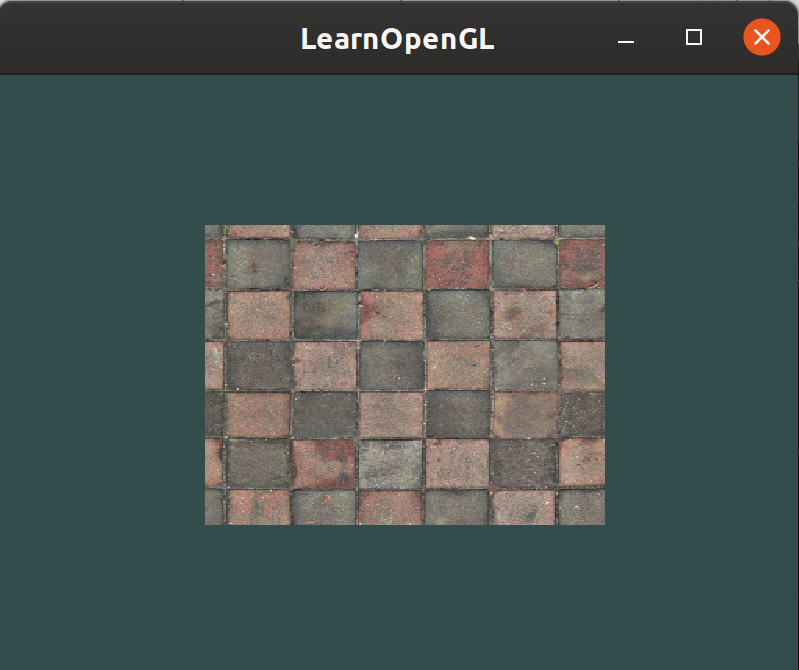

# texturing-opengl
Rendering a rectangle in opengl and applying a texture. The rectangle moves horizontally according to a uniform set to sin(t) where t is time.

I am learning opengl through the wonderful website https://learnopengl.com

# Building and Running
I am working on linux, but by eliminating the linux-specific linker flags in the CMakeLists.txt file, it should run fine on Windows with opengl 3.30 supported hardware.

## Requirements
Rough requirements are as follows. g++ can be substitued for another compiler but you may need to adjust CMakeLists.txt. Still new to cmake myself and have only really worked with g++ as a compiler.
- cmake
- make
- [glfw](https://www.glfw.org/) for window creation
- g++

First cd into the `texturing-opengl` directory then follow the steps below:
1. `mkdir build && cd build`
2. `cmake .. && make`

An executable named `Texture` is made.

The result:

